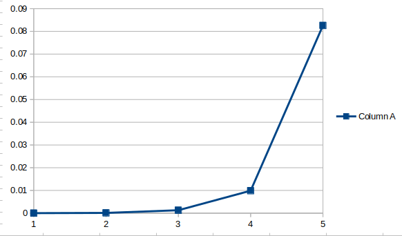

# Lista de exercício 2

| Aluno | Matrícula |
|:-----:|:---------:|
| Arthur Temporim | 14/0016759 |
| Bruno Bragança | 09/0107853  |

## Respostas

Todas as respostas podem ser encontradas no seguinte repositório:

[EDA](https://github.com/arthurTemporim/EDA)

### 1.

O Terceiro morador vai dizer que os outros 2 moradores também são da mesma
ilha, pois se você está em uma ilha, os 3 moradores encontrados vão dizer
a verdade ou mentir da mesma forma.

Não importa o que aconteça ele sempre dirá que os outros 2 são da mesma ilha.

### 2.

É só acender as 2 pontas de uma corda e apenas uma ponta da outra.
Quando a primeira corda queimar por completo terá se passado 30 minutos,
nesse momento é só acender a outra ponta da corda que falta, e dessa
forma os 30 minutos restantes da corda se tornaram 15. Total 45.

### 3.

Por que ele viu "cocô" de coruja na cara dos outros. Porém quando ele percebeu
que os outros 2 também estavam rindo, percebeu que também tinha cocô nele.

### 4.

| 1 | 2 | 3 | 4 | 5 | 6 | 7 | 8 | 9 | 10 | 0  |
|:-:|:-:|:-:|:-:|:-:|:-:|:-:|:-:|:-:|:--:|:--:|
| 1 | 2 | 3 | 4 | 5 | 6 | 0 | 8 | 9 | 10 | 7  |
| 1 | 2 | 0 | 4 | 5 | 6 | 3 | 8 | 9 | 10 | 7  |
| 0 | 2 | 1 | 4 | 3 | 6 | 5 | 8 | 7 | 10 | 9  |
| 0 | 1 | 2 | 3 | 4 | 5 | 6 | 7 | 8 | 9  | 10 |

### 5.

```
#include <stdio.h>
#include <stdlib.h>
#include <time.h>

#define NUMBER_VALUES 30

typedef struct _list _list, List;
typedef struct _node _node, Node;

struct _node {
  int value;
  Node *previous;
  Node *next;
};

struct _list {
  int count;
  Node *head;
  Node *tail;
};

int add_value(List**, int);
Node *add_node(int);
int swap_node(List *, Node*, Node*);
int quicksort(List *, int, int);
void print(Node*);
void print_end(Node*);

int main (int argc, char *argv[]) {
  List *list;
  list = NULL;
  int iterator;

  srand(time(NULL));

  for (iterator = 0; iterator < NUMBER_VALUES; iterator++) {
    add_value(&list,  rand()%100 + 1);
  }
  print(list->head);
  quicksort(list, 0, list->count - 1);
  print(list->head);
  return 1;
}

Node *add_node(int value) {
  Node *tmp = (Node*)malloc(sizeof(Node));
  tmp->value = value;
  tmp->next = NULL;
  tmp->previous = NULL;

  return tmp;
}

int add_value(List **list, int value) {
  Node * node = add_node(value);

  if (*list == NULL) {
    *list = (List*)malloc(sizeof(List));
    (*list)->head = node;
    (*list)->tail = node;
    (*list)->count = 1;
  } else {
    (*list)->tail->next = node;
    (*list)->tail->next->previous = (*list)->tail;
    (*list)->tail = (*list)->tail->next;
    (*list)->count += 1;
  }
}

int swap_node(List *list, Node *first_node, Node *second_node) {
  Node *first_previous = first_node->previous;
  Node *first_next = first_node->next;

  first_node->previous = second_node->previous;
  first_node->next = second_node->next;

  second_node->previous = first_previous;
  second_node->next = first_next;

  if (first_node->previous == first_node) {
    first_node->previous = second_node;
  } else {
    // do nothing
  }
  if (second_node->next == second_node) {
    second_node->next = first_node;
  } else {
    // do nothing
  }

  if (first_node->next != NULL) {
    first_node->next->previous = first_node;
  } else {
    list->tail = first_node;
  }
  first_node->previous->next = first_node;

  if (second_node->previous != NULL) {
    second_node->previous->next = second_node;
  } else {
    list->head = second_node;
  }
  second_node->next->previous = second_node;

  return 1;
}

int quicksort(List *list, int pivot, int last) {
  int aux_first, aux_last;
  Node *node_pivot, *node_first, *node_last;
  while (pivot < last) {
    node_pivot = list->head;
    node_last = list->tail;
    for (aux_first = 0; aux_first < pivot; aux_first++) {
      node_pivot = node_pivot->next;
    }
    for (aux_last = list->count - 1; aux_last > last; aux_last--) {
      node_last = node_last->previous;
    }
    node_first = node_pivot->next;
    aux_first++;

    while(aux_first <= aux_last) {
      while (node_first->value < node_pivot->value) {
        aux_first++;
        node_first = node_first->next;
      }
      while (node_last->value > node_pivot->value) {
        aux_last--;
        node_last = node_last->previous;
      }
      if(aux_first <= aux_last) {
        swap_node(list, node_first, node_last);
        Node *aux = node_first;
        node_first = node_last;
        node_last = aux;
        aux_first++;
        aux_last--;
      }
    }
    quicksort(list, pivot, aux_last);
    quicksort(list, aux_first, last);
  }
  return 1;
}

void print(Node *tmp) {
  if (tmp != NULL) {
    printf("%d ", tmp->value);
    print(tmp->next);
  } else {
    printf("\n");
  }

  // exiting print
}

void print_end(Node *tmp) {
  if (tmp != NULL) {
    printf("%d ", tmp->value);
    print_end(tmp->previous);
  } else {
    printf("\n");
  }

  // exiting print
}
```

### 6.

```
#include <iostream>
#include <time.h>    

using namespace std;

void heapify(int *heap, int i, int size_of_heap);
void heapsort(int *heap, int size_of_heap);
void build_heap(int *heap, int size_of_heap);
void initialize_heap(int heap[], int size_of_heap);
void print_heap(int heap[], int size_of_heap);

int main() {

	const int size_of_heap = 100000;
	clock_t begin, end;
	double normal_sort=0, insertion_sort=0;

	int *heap = (int*) malloc((size_of_heap+1) * sizeof(int));
	initialize_heap(heap, size_of_heap);
	cout << "INITAL ";
	//print_heap(heap, size_of_heap);

	build_heap(heap,size_of_heap);
	//print_heap(heap, size_of_heap);

	heapsort_insertion(heap, size_of_heap);
	begin =  clock();
	heapsort(heap, size_of_heap);
	end = clock();
	normal_sort = (double) (end-begin)/CLOCKS_PER_SEC;
	cout << "SORTED";
	//print_heap(heap, size_of_heap);
	cout << "TIME OF NORMAL SORT " << normal_sort << endl;

	return 0;
}


void heapify(int *heap, int i, int size_of_heap) {
	int j, temp;
	temp = heap[i];
	j = 2*i;

	while (j <= size_of_heap) {

		if (j < size_of_heap && heap[j+1] > heap[j]) {
			j = j+1;
		} if (temp > heap[j]) {
			break;
		} else if (temp <= heap[j]) {
			heap[j/2] = heap[j];
			j = 2*j;
		}
	}

	heap[j/2] = temp;
}

void heapsort(int *heap, int size_of_heap) {
	int tmp;
	for (int i = size_of_heap; i >= 2; i--) {

		tmp = heap[i];
		heap[i] = heap[1];
		heap[1] = tmp;

		heapify(heap, 1, i - 1);
	}
}

void build_heap(int *heap, int size_of_heap) {
	for(int i = size_of_heap/2; i >= 1; i--) {
		heapify(heap, i, size_of_heap);
	}
}

void initialize_heap(int heap[], int size_of_heap) {
	for (int i = 0; i <= size_of_heap; i++) {
		heap[i] = i;
	}
}

void print_heap(int heap[], int size_of_heap) {
	cout << "HEAP" << endl;
	cout << "[";
	for (int i = 1; i <= size_of_heap; i++) {
		cout<< heap[i] << " ";
	}
	cout << "]" << endl;
}
```

### 7.

O gráfico gerado pelo código indica que o comportamento do Radix implementado com countSort é semelhante à uma função exponencial e não linear.


